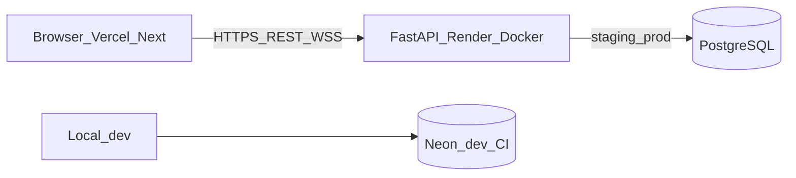

# Architecture overview

- **Browser** loads Next.js from **Vercel**; calls **Render** API (REST + WebSocket).
- **Staging / production** data: **Render PostgreSQL** (one DB per environment).
- **Local / CI:** **Neon** branches — not used for Render runtime.

Layers (backend): **router → service → repository → model**; Pydantic **schemas** for I/O.
